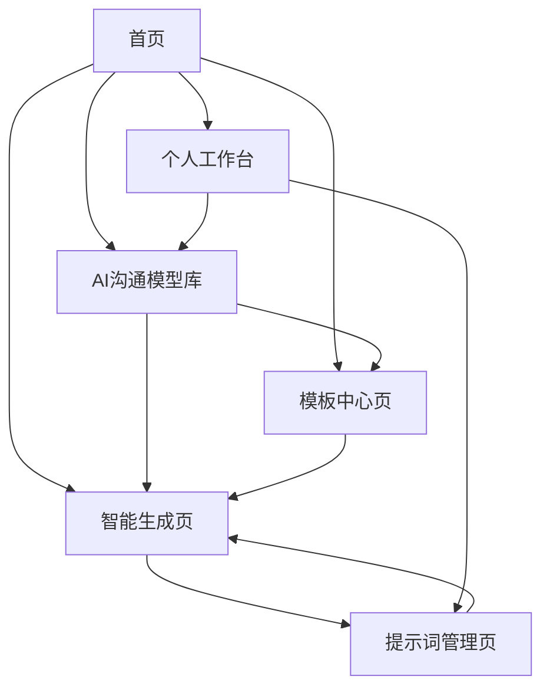

# AI提示词工程助理平台产品需求文档

## 1. 产品概述

本产品是一个专业的AI提示词工程助理平台，旨在帮助用户快速生成高质量的结构化提示词。用户只需输入简单的需求设想，系统即可自动构建逻辑清晰、要素完整的结构化提示词，完成AI角色设定并提供相关解决方案。

产品面向AI应用开发者、内容创作者和企业用户，解决提示词编写困难、效果不佳的痛点，提升AI交互效率和质量。

## 2. 核心功能

### 2.1 AI沟通模型框架

基于实践验证的14个高效AI沟通模型，为用户提供结构化提示词生成的理论基础：

1. **三段式模型**：我是谁 + 我要干什么 + 我有什么要求
2. **STAR模型**：情境(Situation) + 任务(Task) + 行动(Action) + 结果(Result)
3. **5W1H模型**：Who + What + When + Where + Why + How
4. **SMART模型**：具体(Specific) + 可衡量(Measurable) + 可达成(Achievable) + 相关性(Relevant) + 时限性(Time-bound)
5. **PREP模型**：观点(Point) + 理由(Reason) + 例证(Example) + 观点(Point)
6. **SCAMPER模型**：替代(Substitute) + 组合(Combine) + 适应(Adapt) + 修改(Modify) + 其他用途(Put to other uses) + 消除(Eliminate) + 重新安排(Rearrange)
7. **GROW模型**：目标(Goal) + 现实(Reality) + 选择(Options) + 意愿(Will)
8. **AIDA模型**：注意(Attention) + 兴趣(Interest) + 欲望(Desire) + 行动(Action)
9. **PDCA模型**：计划(Plan) + 执行(Do) + 检查(Check) + 行动(Act)
10. **SWOT模型**：优势(Strengths) + 劣势(Weaknesses) + 机会(Opportunities) + 威胁(Threats)
11. **MECE模型**：相互独立(Mutually Exclusive) + 完全穷尽(Collectively Exhaustive)
12. **金字塔原理**：结论先行 + 以上统下 + 归类分组 + 逻辑递进
13. **OGSM模型**：目标(Objective) + 目的(Goal) + 策略(Strategy) + 措施(Measure)
14. **RACI模型**：负责(Responsible) + 批准(Accountable) + 咨询(Consulted) + 知情(Informed)

### 2.2 用户角色

| 角色 | 注册方式 | 核心权限 |
|------|----------|----------|
| 普通用户 | 邮箱注册 | 可生成和管理个人提示词，使用基础模板和AI沟通模型 |
| 高级用户 | 付费升级 | 可使用所有AI沟通模型，导出提示词，批量管理，自定义模型 |

### 2.3 功能模块

我们的AI提示词工程助理平台包含以下主要页面：

1. **首页**：产品介绍、快速生成入口、AI沟通模型展示、热门模板
2. **智能生成页**：需求输入、模型选择、智能生成、实时预览、参数调整
3. **提示词管理页**：个人提示词库、分类管理、搜索筛选、批量操作
4. **AI沟通模型库**：14种模型详解、使用指南、应用场景、实例演示
5. **模板中心页**：预设模板浏览、模板详情、模板使用、自定义模板
6. **个人工作台**：用户信息、使用统计、收藏管理、设置中心

### 2.4 页面详情

| 页面名称 | 模块名称 | 功能描述 |
|----------|----------|----------|
| 首页 | 产品介绍区 | 展示平台核心价值和AI沟通模型理论基础，包含使用流程说明 |
| 首页 | 快速生成入口 | 提供简化的需求输入框，一键跳转到智能生成页面 |
| 首页 | AI沟通模型展示 | 展示14种AI沟通模型的核心特点和应用场景 |
| 首页 | 热门模板展示 | 展示最受欢迎的提示词模板，支持快速预览和使用 |
| 智能生成页 | 需求输入区 | 支持自然语言描述需求，提供引导性问题和示例 |
| 智能生成页 | 模型选择器 | 智能推荐或手动选择适合的AI沟通模型框架 |
| 智能生成页 | 智能生成引擎 | 基于选定模型和用户输入自动生成结构化提示词，包含角色设定、任务描述、输出格式等 |
| 智能生成页 | 实时预览区 | 实时显示生成的提示词效果，支持格式化展示和模型结构可视化 |
| 智能生成页 | 参数调整面板 | 允许用户调整生成参数，如创意度、专业度、详细程度、模型权重等 |
| 提示词管理页 | 提示词列表 | 展示用户创建的所有提示词，支持列表和卡片视图切换 |
| 提示词管理页 | 分类管理 | 支持自定义分类标签，按类别组织提示词 |
| 提示词管理页 | 搜索筛选 | 支持关键词搜索和多维度筛选功能 |
| 提示词管理页 | 批量操作 | 支持批量删除、导出、分类等操作 |
| AI沟通模型库 | 模型分类展示 | 按应用场景、复杂度、行业领域分类展示14种AI沟通模型 |
| AI沟通模型库 | 模型详解页面 | 详细介绍每种模型的原理、结构、适用场景和使用技巧 |
| AI沟通模型库 | 实例演示 | 提供每种模型的实际应用案例和生成效果对比 |
| AI沟通模型库 | 使用指南 | 交互式教程，指导用户如何选择和使用合适的模型 |
| 模板中心页 | 模板分类浏览 | 按行业、场景、AI沟通模型等维度分类展示模板 |
| 模板中心页 | 模板详情展示 | 显示模板的详细信息、使用说明、关联模型和效果示例 |
| 模板中心页 | 模板使用功能 | 一键应用模板到生成器，支持个性化定制和模型切换 |
| 模板中心页 | 自定义模板 | 允许用户基于AI沟通模型创建和分享自定义模板 |
| 个人工作台 | 用户信息管理 | 显示和编辑用户基本信息、头像、偏好设置等 |
| 个人工作台 | 使用统计 | 展示生成次数、模型使用频率、效果评分等数据统计 |
| 个人工作台 | 收藏管理 | 管理收藏的提示词、模板和AI沟通模型 |
| 个人工作台 | 设置中心 | 个性化设置、通知偏好、账户安全、API配置等 |

## 3. 核心流程

**AI提示词工程助理核心工作流程：**

1. **需求理解阶段**：用户输入自然语言需求描述 → 系统分析需求类型和复杂度
2. **模型匹配阶段**：智能推荐最适合的AI沟通模型 → 用户确认或手动选择模型
3. **结构化生成阶段**：基于选定模型框架生成结构化提示词 → 包含角色设定、任务描述、约束条件等
4. **优化调整阶段**：用户预览生成结果 → 调整参数和模型权重 → 重新生成或微调
5. **保存管理阶段**：保存到个人提示词库 → 添加标签和分类 → 支持分享和导出

**用户操作流程：**

用户访问首页了解AI沟通模型理论 → 选择快速生成或浏览模型库 → 在智能生成页面输入需求并选择模型 → 系统基于AI沟通模型生成结构化提示词 → 用户预览、调整参数和测试效果 → 保存到个人工作台进行管理。

**高级用户流程：**

高级用户可以自定义AI沟通模型组合 → 创建个性化模板 → 批量生成和管理提示词 → 导出到外部系统 → 查看详细的模型使用统计和效果分析。

## 4. 用户界面设计

### 4.1 设计风格

- **主色调**：科技蓝 (#2563EB) 和纯白 (#FFFFFF)
- **辅助色**：浅灰 (#F8FAFC) 和深灰 (#64748B)
- **按钮样式**：圆角矩形，渐变效果，悬停动画
- **字体**：主标题使用 24px 粗体，正文使用 16px 常规字体
- **布局风格**：卡片式设计，顶部导航栏，响应式布局
- **图标风格**：线性图标，统一的视觉语言，支持深浅主题切换

### 4.2 页面设计概览

| 页面名称 | 模块名称 | UI元素 |
|----------|----------|--------|
| 首页 | 产品介绍区 | 大标题、AI沟通模型理论介绍、功能特点卡片、渐变背景、CTA按钮 |
| 首页 | 快速生成入口 | 居中的输入框、占位符文本、模型快选按钮、生成按钮 |
| 首页 | AI沟通模型展示 | 14种模型的图标网格、模型名称、适用场景标签、点击跳转 |
| 首页 | 热门模板展示 | 横向滚动的模板卡片、关联模型标签、使用次数、预览按钮 |
| 智能生成页 | 需求输入区 | 多行文本框、字数统计、智能提示、示例需求 |
| 智能生成页 | 模型选择器 | 模型卡片选择、推荐标识、模型对比、切换动画 |
| 智能生成页 | 智能生成引擎 | 生成按钮、模型处理进度、加载动画、生成历史 |
| 智能生成页 | 实时预览区 | 结构化显示、模型框架可视化、复制按钮、导出选项 |
| 智能生成页 | 参数调整面板 | 模型权重滑块、创意度控制、专业度调节、实时预览更新 |
| 提示词管理页 | 提示词列表 | 卡片布局、模型标签、效果评分、操作菜单 |
| 提示词管理页 | 分类管理 | 模型分类、自定义标签、颜色编码、拖拽排序 |
| 提示词管理页 | 搜索筛选 | 智能搜索、模型筛选、效果排序、批量选择 |
| AI沟通模型库 | 模型分类展示 | 分类导航、模型卡片、复杂度指示、应用场景图标 |
| AI沟通模型库 | 模型详解页面 | 模型结构图、原理说明、参数配置、使用技巧 |
| AI沟通模型库 | 实例演示 | 对比展示、效果预览、交互式示例、评分系统 |
| 模板中心页 | 模板分类浏览 | 模型关联显示、行业分类、场景标签、质量评级 |
| 模板中心页 | 自定义模板 | 模板编辑器、模型选择、预览功能、分享设置 |
| 个人工作台 | 使用统计 | 模型使用频率图表、效果趋势分析、推荐优化建议 |
| 个人工作台 | 收藏管理 | 分类收藏、快速访问、同步状态、导出功能 |

### 4.3 响应式设计

产品采用移动优先的响应式设计，支持桌面端、平板和手机端访问。在移动端优化触摸交互体验，调整布局和字体大小以适应小屏幕设备。